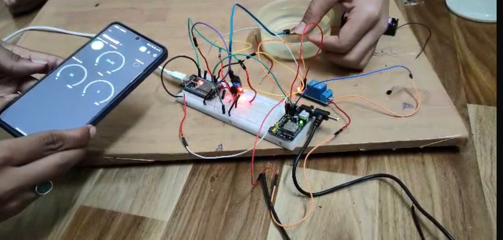

# 🌱 Smart Agriculture IoT System with Web Dashboard — ESP32 (SIH 2025)

## Overview

This project was developed as part of Smart India Hackathon 2025 (Hardware category), where our team **Team Electrominds** qualified through all 3 internal rounds.

The aim was to improve farming in hilly regions by using sensor-based monitoring, automation, and IoT.
In addition to the embedded system, a **web dashboard was developed** to visualize real-time farm data and assist in decision-making.

---

## Problem Statement

Farming in hilly regions faces:

* Uneven terrain
* Unpredictable rainfall
* Difficulty in monitoring crops

This leads to low yield and inefficient resource usage.

---

## What We Built

* ESP32-based multi-sensor monitoring system
* Automated irrigation using soil moisture
* Environmental monitoring (temperature, humidity, light)
* IoT-based data transmission using Blynk
* Web dashboard for real-time visualization and alerts
* Concept for drone-based modular sensing

---

## ⚙️ System Architecture

ESP32 → Blynk Cloud → Web Dashboard

* Sensors connected to ESP32 collect field data
* Data is transmitted over WiFi to Blynk Cloud
* Web dashboard displays processed data in a user-friendly format

---

## 🔄 Data Flow

1. Sensors collect real-time environmental data
2. ESP32 reads and processes sensor values
3. Data is sent to Blynk Cloud via WiFi
4. Web dashboard visualizes the data
5. Alerts are generated based on threshold conditions

---

## System Working

* Sensors collect real-time data:

  * Soil moisture
  * Temperature & humidity
  * Light intensity

* ESP32 processes this data:

  * If soil is dry → pump turns ON
  * If soil is sufficient → pump turns OFF

* Data is transmitted to IoT platform and displayed on dashboard

---

## 🌐 Web Dashboard Features

The project includes a web-based dashboard for monitoring and analysis:

### 📊 Live Sensor Monitoring

* Soil moisture (with percentage display)
* Temperature and humidity
* Soil pH (simulated/extended feature)
* Light intensity indication

### 🚨 Smart Alerts

* Irrigation alerts when moisture drops below threshold
* Rain alerts based on weather conditions
* Crop health status indicators

### 🌦️ Weather Integration

* Current temperature and conditions
* Wind speed and direction
* Humidity and UV index
* Weekly weather forecast

### 📈 Farm Overview

* Active crop count
* Soil moisture summary
* System/drone status

### 🔄 Auto Refresh

* Dashboard updates automatically at intervals
* Provides near real-time monitoring

---

## 🛠️ Technologies Used

* ESP32 (Embedded System)
* Blynk IoT Platform
* HTML, CSS, JavaScript (Web Dashboard)
* Sensors (Soil moisture, DHT11, LDR)

---

## Components Used

* ESP32
* Soil Moisture Sensor
* DHT11 Temperature Sensor
* LDR Sensor
* Relay Module
* Water Pump
* Breadboard & Jumper Wires
* External Power Supply

---

## Challenges Faced

* ESP32 was not detected initially
  → Resolved by installing proper drivers

* System was unstable on USB power
  → Solved using external AC-DC power supply

---

## Impact (Expected)

* ~20–30% improvement in efficiency
* Reduced manual effort
* Better irrigation control
* Suitable for hilly terrain farming

---

## Future Scope

* Rainfall prediction using ML (Python)
* Direct ESP32 → Web server communication
* Fully automated irrigation system
* Drone-based sensor integration
* AI-based crop recommendations

---

## 📁 Project Structure

smart_agro_esp32.ino
README.md
images/

---

## 📸 Project Image

### Real-time Monitoring using Blynk and Web Dashboard

---

## Note

This project was part of Smart India Hackathon 2025 and involved both hardware implementation and system-level design for real-world agricultural problems.

---

## 💻 Web Dashboard Code

The frontend for the dashboard is included in the repository.

Location:
web_dashboard/

Technologies:
- HTML
- CSS
- JavaScript

This dashboard is designed to visualize sensor data in a clean and user-friendly way.
