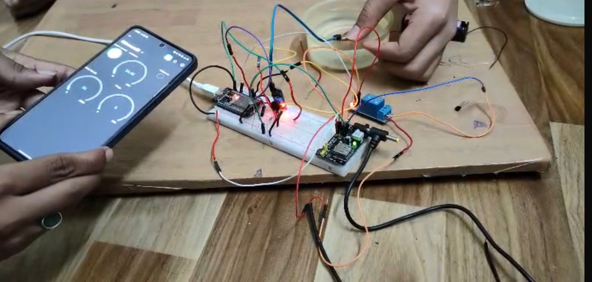
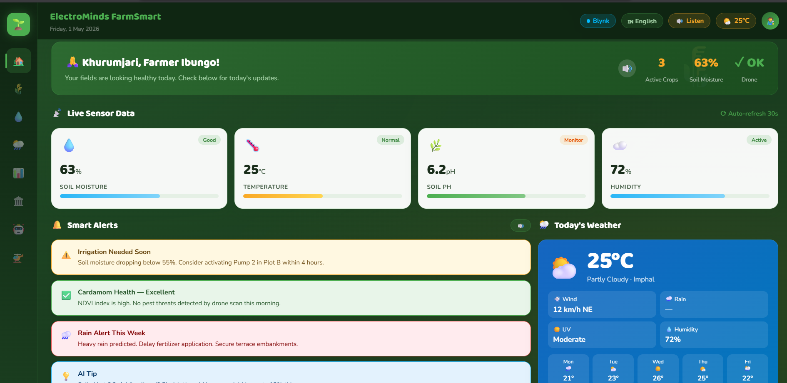
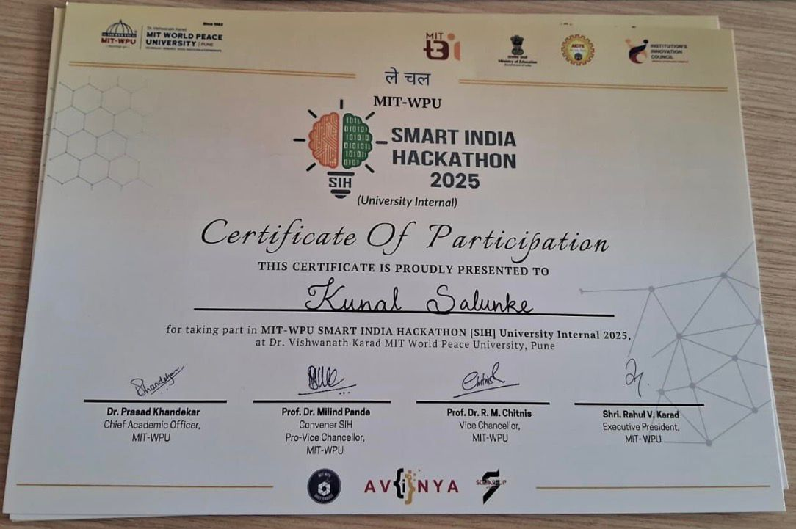

# 🌱 Smart Agriculture IoT & Decision Support System

### ESP32 + Blynk + Web Dashboard | Smart India Hackathon 2025

---

## 📌 Overview

This project was developed as part of **Smart India Hackathon 2025 (Hardware Category)** by **Team Electrominds**, where our team successfully qualified through all **3 internal evaluation rounds** including hardware demonstration and technical review.

The system was designed to address real-world agricultural challenges faced in **hilly and uneven terrains**, where farmers often struggle with:

* Irregular rainfall
* Water mismanagement
* Difficult crop monitoring
* Low resource efficiency
* Lack of real-time insights

To solve this, we built a **Smart Agriculture IoT System** using ESP32, multiple environmental sensors, cloud connectivity, automation logic, and a modern web dashboard for live monitoring and intelligent decision support.

The project combines:

* Embedded Systems
* IoT Communication
* Sensor Fusion
* Automation
* Web Visualization
* Smart Alerts
* AI/ML-based future prediction concepts

---

# 🚜 Problem Statement

Agriculture in hilly regions is highly unpredictable due to:

* Uneven land surfaces
* Inconsistent irrigation
* Rapid environmental changes
* Limited accessibility for monitoring
* Dependence on manual observation

This often leads to:

* Reduced crop yield
* Water wastage
* Excess fertilizer usage
* Increased labor effort
* Poor decision-making

---

# 💡 Proposed Solution

We developed a **modular smart farming system** capable of:

✅ Monitoring environmental conditions in real-time
✅ Automatically controlling irrigation
✅ Sending live data to cloud platforms
✅ Visualizing analytics on a responsive dashboard
✅ Providing smart alerts and farming insights
✅ Supporting future drone-based expansion modules

---

# ⚙️ System Architecture

```text
Sensors → ESP32 → Blynk Cloud → Web Dashboard
```

### Workflow

1. Sensors continuously collect farm data
2. ESP32 processes readings locally
3. Data is transmitted over WiFi using Blynk
4. Dashboard visualizes live parameters
5. Smart alerts assist decision-making
6. Irrigation automation works based on thresholds

---

# 🔄 System Working

## 📡 Sensor Monitoring

The ESP32 continuously monitors:

* Soil Moisture
* Temperature
* Humidity
* Light Intensity

### Sensors Used

| Parameter              | Sensor               |
| ---------------------- | -------------------- |
| Soil Moisture          | Soil Moisture Sensor |
| Temperature & Humidity | DHT11                |
| Light Intensity        | LDR                  |

---

## 💧 Smart Irrigation Logic

The irrigation system operates automatically:

* If soil moisture drops below threshold:

  * Relay activates
  * Water pump turns ON

* If moisture becomes sufficient:

  * Pump turns OFF

This reduces unnecessary water usage and minimizes manual intervention.

---

# 🌐 IoT Integration

The project uses:

* **ESP32 WiFi connectivity**
* **Blynk IoT platform**
* **Real-time cloud synchronization**

This allows remote monitoring directly from:

* Mobile devices
* IoT dashboards
* Web interfaces

---

# 🖥️ Advanced Web Dashboard

A professional farm monitoring dashboard was developed using:

* HTML
* CSS
* JavaScript

The dashboard provides a centralized smart farming interface for monitoring, visualization, and alerts.

---

# ✨ Dashboard Features

## 📊 Live Sensor Monitoring

Real-time display of:

* Soil Moisture (%)
* Temperature (°C)
* Humidity (%)
* Soil pH (extended feature)
* Crop status indicators

---

## 🚨 Smart Alerts System

The dashboard generates intelligent alerts such as:

* Irrigation Needed Soon
* Rain Alerts
* Crop Health Notifications
* Moisture Warnings

These alerts help farmers take proactive decisions instead of relying on guesswork.

---

## 🌦️ Weather Analytics

Integrated weather section displaying:

* Current weather conditions
* Temperature
* Wind speed & direction
* UV index
* Humidity
* Weekly weather forecast

---

## 📈 Farm Overview

Dashboard overview cards include:

* Active crop count
* Soil condition summary
* Drone/system status
* Live monitoring indicators

---

## 🔄 Auto Refresh System

The dashboard updates automatically at regular intervals to provide near real-time monitoring.

---

# 🧠 AI / ML Expansion Concept

The project was designed with future AI integration in mind.

Proposed future features include:

* Rainfall prediction using ML models
* Yield estimation
* Pest risk prediction
* Smart fertilizer recommendation
* Predictive irrigation scheduling

One of the evaluation judges also recommended exploring patent possibilities for the concept.

---

# 🛠️ Technologies Used

| Category        | Technologies              |
| --------------- | ------------------------- |
| Embedded System | ESP32                     |
| IoT Platform    | Blynk                     |
| Frontend        | HTML, CSS, JavaScript     |
| Sensors         | Soil Moisture, DHT11, LDR |
| Communication   | WiFi                      |
| Automation      | Relay + Pump Control      |

---

# 🔩 Hardware Components

* ESP32 Development Board
* Soil Moisture Sensor
* DHT11 Sensor
* LDR Module
* Relay Module
* Water Pump
* Breadboard
* Jumper Wires
* External AC-DC Power Supply

---

# ⚠️ Challenges Faced

## ESP32 Driver Issue

Initially, the ESP32 board was not detected properly on the system.

### Solution

Installed the required ESP32 USB drivers and configured Arduino IDE board support.

---

## Power Stability Issue

The system behaved inconsistently when powered directly through USB.

### Solution

Used an external AC-DC power supply to provide stable current for sensors and relay operation.

---

# 📈 Expected Impact

The proposed system can help achieve:

* ~20–30% improvement in farming efficiency
* Better water utilization
* Reduced manual effort
* Faster monitoring
* Improved decision-making
* Better suitability for hilly terrain agriculture

---

# 🚀 Future Improvements

* Full AI-driven crop recommendations
* Cloud database integration
* ESP32 hosted standalone dashboard
* Drone-mounted detachable sensor modules
* Mobile app integration
* Automated fertilizer management
* Remote pump control

---

# 📁 Project Structure

```text
Smart-Agriculture-IoT-System/
│
├── smart_agro_esp32.ino
├── web_dashboard/
│     └── index.html
├── images/
│     ├── agro_system.jpg
│     └── web_dashboard.png
├── docs/
│     └── sih_certificate.jpg
└── README.md
```

---

# 📸 Project Images

## 🔌 Hardware Prototype + Blynk Monitoring



---

## 🌐 Smart Web Dashboard Interface



---

# 🏆 Smart India Hackathon 2025

This project was developed under **Team Electrominds** for **Smart India Hackathon 2025 (Hardware Category)**.

Our team successfully cleared:

✅ Round 1
✅ Round 2
✅ Round 3

including hardware demonstration and technical evaluation.

---

## 📜 SIH Participation Certificate



---

# 💻 Web Dashboard Source Code

The complete dashboard frontend is included inside:

```text
web_dashboard/index.html
```

The dashboard is implemented using:

* HTML
* CSS
* JavaScript

and provides a responsive interface for real-time smart farming analytics.

---

# 📚 Key Learnings

This project helped in gaining practical experience with:

* ESP32 firmware development
* IoT communication
* Sensor interfacing
* Automation systems
* Real-time monitoring
* Web dashboard design
* Embedded debugging
* Power management challenges
* Team-based hardware development

---

# 📄 License

This project is licensed under the MIT License.

Feel free to use, modify, and improve the project for educational and research purposes.
